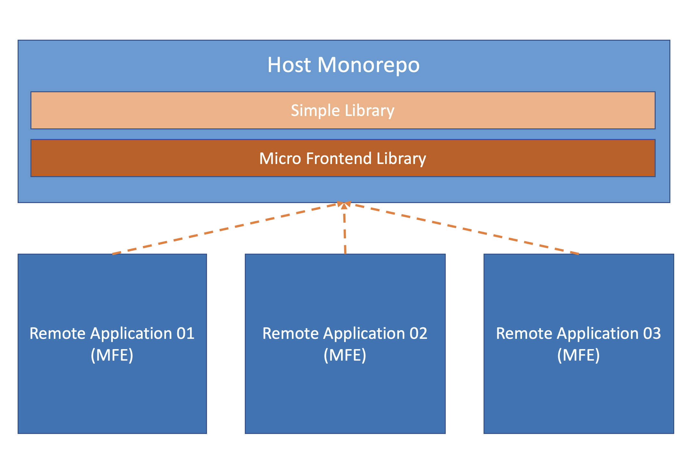
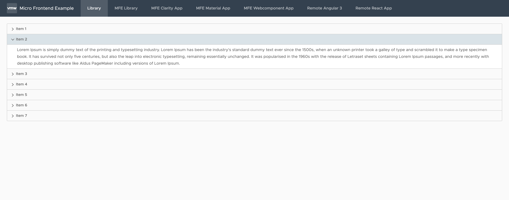

# Example for Ng Micro Frontend Architecture

This repo demonstrates micro frontend architecuture using [Module Federation provided by webpack.](https://webpack.js.org/concepts/module-federation/)
- ``ng-host-monorepo`` - Shell (host) application
- ``mfe01``- Simple project library
- ``mfe02``- Micro Frontend project application
- ``remote01`` - Micro Frontend Angular + Clarity application
- ``remote02`` - Micro Frontend Angular + Material application
- ``remote03`` - Micro Frontend Angular Webcomponent



## Installation and Usage
- Install packages: ``npm install``
- Build & start micro frontend project application: 
    ```
    npm run build mfe02
    ```
    ```
    ng serve mfe2 -o
    ```
- Build & start micro frontend application inside ``remote01``, ``remote02`` and ``remote03`` application by using following commands for all applications: 
    ```
    npm run build
    ```
    ```
    ng serve -o 
    ```
- Start shell application
    ```
    ng serve -o 
    ```




## Plugins used in the project
##### [https://www.npmjs.com/package/@angular-architects/module-federation](https://www.npmjs.com/package/@angular-architects/module-federation)
##### [https://www.npmjs.com/package/@angular-architects/module-federation-tools](https://www.npmjs.com/package/@angular-architects/module-federation-tools)
##### [https://www.npmjs.com/package/ngx-build-plus](https://www.npmjs.com/package/ngx-build-plus)


## More Details on Module Federation

Have a look at this [article series about Module Federation](https://www.angulararchitects.io/aktuelles/the-microfrontend-revolution-part-2-module-federation-with-angular/)

